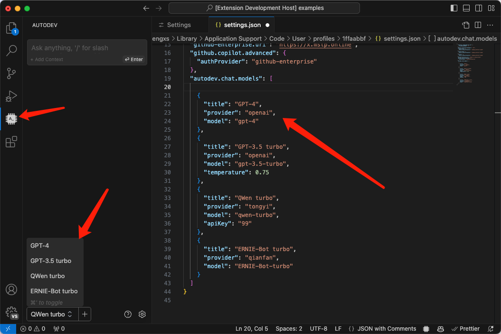

# Quick Start


In the vscode configuration, search for `autodev`, or click the ⚙️ button in the lower right footer of the dialog panel

在当前的设计里，由于精力不足，在 UI 设计上我们基于 Continue 的设计，因此会出现一些不符合直觉的地方，我们会在后续的版本中逐渐优化。诸如于：
**Chat UI 和代码中的 LLM 模型需要分开配置。

## Basic

This is the default configuration and can be overridden in different functional areas.

### Anthropic

See [Developer doc](https://docs.anthropic.com/en/docs/intro-to-claude)

- **Base URL** Anthropic API URL, See [API Reference](https://docs.anthropic.com/en/api/getting-started)
- **API Key** Anthropic API key.
- **Model** Chat model used

### OpenAI

See [open.com](https://platform.openai.com/docs/introduction)

- **API Type** OpenAI Official or Microsoft azure servers.
- **Base URL** OpenAI API URL.
- **API Key** Our legacy keys. Provides access to all organizations and all projects that user has been added to; access [API Keys](https://platform.openai.com/account/api-keys) to view your available keys. We highly advise transitioning to project keys for best security practices, although access via this method is currently still supported.
- **Model** Chat model used, See [Model endpoint compatibility](https://platform.openai.com/docs/models/model-endpoint-compatibility)
- **Project** Provides access to a single project (preferred option); Access [Project API Keys](https://platform.openai.com/settings/organization/general) by selecting the specific project you wish to generate keys against.
- **Organization** For users who belong to multiple organizations or are accessing their projects through their legacy user API key, you can pass a header to specify which organization and project is used for an API request. Usage from these API requests will count as usage for the specified organization and project.

### Baidu Cloud WenXin

Baidu Cloud API Key Or Secret Key, See [Create an application](https://console.bce.baidu.com/qianfan/ais/console/applicationConsole/application).

- **API Key** Baidu Cloud API Key
- **Secret Key** Baidu Cloud Secret Key
- **Model** Chat model used

### Ali Cloud TongYi

See [开通 DashScope 并创建 API-KEY](https://help.aliyun.com/zh/dashscope/developer-reference/activate-dashscope-and-create-an-api-key).

- **API Key** Baidu Cloud API Key
- **Model** Chat model used
- **EnableSearch** 启用互联网搜索，模型会将搜索结果作为文本生成过程中的参考信息，但模型会基于其内部逻辑判断是否使用互联网搜索结果。默认：关闭。

## Chat

### Models

Shows in chat panel model selection list.



- **Title** Display selected text
  - **type** `string`
- **Provider** Use that LLM Provider.
  - **type** `"anthropic" | "openai" | "qianfan" | "tongyi"`
- **Base URL** LLM API baseURL, Default use provider config.
  - **type** `string | undefined`
- **API Key** LLM API key, Default use provider config.
  - **type** `string | undefined`
- **Secret Key** Only Baidu QianFan provider
  - **type** `string | undefined`
- **Model** Model name
  - **type** `string`
- **Temperature** Amount of randomness injected into the response. Ranges from 0 to 1.
  - **type** `number | undefined`
- **MaxTokens** A maximum number of tokens to generate before stopping.
  - **type** `number | undefined`
- **Stop** A list of strings to use as stop words.
  - **type** `string[] | undefined`

examples:

```jsonc
[
  {
    "title": "GPT-4",
    "provider": "openai",
    "model": "gpt-4"
  },
  {
    "title": "GPT-3.5 turbo",
    "provider": "openai",
    "model": "gpt-3.5-turbo",
    "temperature": 0.75
  },
  {
    "title": "QWen turbo",
    "provider": "tongyi",
    "model": "qwen-turbo"
  },
  {
    "title": "ERNIE-Bot turbo",
    "provider": "qianfan",
    "model": "ERNIE-Bot-turbo"
  }
]
```

If there is no configuration of apikey, default get from basic config.

## Code completion

### Model

Model for overwrite provider in the base configuration. see `autodev.openai.model`

> [!NOTE]  
> Currently only supports OpenAI chat models.

Config OpenAI example:

1. open `settings.json` in vscode
2. add the following configuration

```
  "autodev.openaiCompatibleConfig": {
    "apiType": "openai",
    "model": "moonshot-v1-8k",
    "apiBase": "https://api.moonshot.cn/v1",
    "apiKey": "xxx"
  },
  "autodev.completion.model": "openai",
```

### enableRename

Enable rename suggestion
\

## Embedding

### Models

### Builtin: Sentence Transformerjs in Local

### OpenAI

### Ollama

